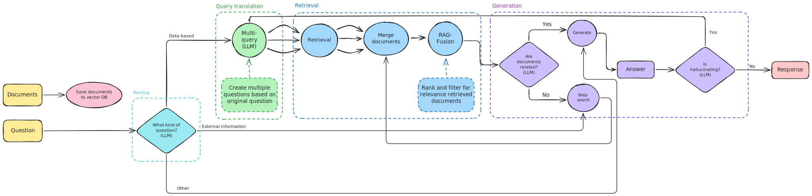

# Adaptive RAG Agent API

## Overview

This project implements an advanced **Adaptive Retrieval-Augmented Generation (RAG)** agent using **FastAPI** and **LangGraph**. Unlike static RAG pipelines, this agent employs a cognitive architecture that dynamically selects data sources, optimizes retrieval through query translation and fusion, and verifies its own outputs using self-reflection mechanisms.

The system is designed as a **stateless, ephemeral** service. All uploaded documents, vector indices, and conversation history are stored exclusively in memory and are permanently purged upon server restart, ensuring strict data privacy and a clean state for development.

## Workflow Architecture



The request processing pipeline consists of the following nodes:

1. **Router Node:** Analyzes the input and directs the flow. It resets the loop counter and technical state for the new turn.
2. **Retrieve Node:** (If Vectorstore selected) Executes Multi-Query expansion, retrieves documents from ChromaDB, and applies RAG Fusion.
3. **Grade Documents Node:** Filters retrieved documents. If the relevance is low, the workflow redirects to Web Search.
4. **Web Search Node:** (If Web Search selected or Fallback triggered) Queries Tavily for external information.
5. **Generate Node:** Synthesizes an answer using the context (from Vectorstore or Web) and the conversation history.
6. **Hallucination Check Node:** Validates the answer. If the answer is not grounded in facts, it triggers a feedback loop to the Web Search node for correction.

## Core Features

### 1. Adaptive Routing

The agent utilizes a semantic router to classify user intent into three distinct pathways:

* **Vectorstore:** Selected for queries regarding uploaded documents (PDFs) or specific domain knowledge.
* **Web Search:** Selected for questions about real-time events, news, or factual information not present in the local context (via Tavily).
* **Generative Chat:** Selected for conversational history (memory), logic puzzles, coding tasks, or general greetings.

### 2. Multi-Query Retrieval & Fusion

To overcome the limitations of distance-based vector search, the system employs **Query Translation**:

* The LLM generates three alternative perspectives of the user's query.
* Documents are retrieved for all variations.
* **Reciprocal Rank Fusion (RRF)** is applied to re-rank and combine the results, ensuring that the most consistently relevant documents appear at the top.

### 3. Self-Correction & Grading

The workflow includes two critical quality control loops:

* **Document Grading:** Before generation, retrieved documents are evaluated for relevance. Irrelevant chunks are discarded. If no relevant documents remain, the system falls back to a web search.
* **Hallucination Check:** After generation, a separate evaluator verifies if the answer is grounded in the provided facts. If a hallucination is detected, the agent initiates a retry loop (up to 3 times) using web search to correct the error.

## Technical Stack

* **API Framework:** FastAPI
* **Orchestration:** LangGraph (State Machine), LangChain
* **Vector Database:** ChromaDB (In-Memory Configuration)
* **LLM Inference:** Groq Cloud (Llama 3.3 70B for generation, Llama 3.1 8B/GPT-OSS for routing)
* **Embeddings:** Google Generative AI (Gemini Embeddings)
* **External Search:** Tavily AI Search

---

## Installation and Setup

### Prerequisites

* Python 3.10 or higher
* API Keys for Google (Gemini), Groq, and Tavily.

### 1. Clone the Repository

```bash
git clone https://github.com/sahurai/adaptive-rag-agent.git
cd adaptive-rag-agent
```

### 2. Create Virtual Environment

```bash
python -m venv venv
source venv/bin/activate  # Linux/Mac
# venv\Scripts\activate   # Windows
```

### 3. Install Dependencies

```bash
pip install -r requirements.txt
```

### 4. Environment Configuration

Create a `.env` file in the project root with the following variables:

```ini
GOOGLE_API_KEY=your_google_api_key_here
GROQ_API_KEY=your_groq_api_key_here
TAVILY_API_KEY=your_tavily_api_key_here

# Optional: LangSmith Tracing (useful for debugging the graph)
LANGSMITH_TRACING=true
LANGSMITH_ENDPOINT=https://eu.api.smith.langchain.com
LANGCHAIN_API_KEY=your_langchain_api_key_here
LANGCHAIN_PROJECT="Adaptive-RAG-Agent"
```

### 5. Run the Server

```bash
python main.py
```

The API will start at `http://127.0.0.1:8000`.
Interactive API documentation (Swagger UI) is available at `http://127.0.0.1:8000/docs`.

---

## API Documentation

### POST /api/upload

Uploads a PDF file, splits it into chunks, and ingests it into the in-memory vector store.

* **form-data:**
* `file`: The PDF file.
* `session_id`: A unique string identifier for the user session.


### POST /api/chat

The primary interface for interaction. Triggers the LangGraph workflow.

* **form-data:**
* `question`: The user's query.
* `session_id`: The unique identifier used during upload.


* **Response:**
* `answer`: The generated text.
* `source`: The data source used (`vectorstore`, `web_search`, or `generate`).
* `hallucination_grade`: The result of the grounding check (`yes` or `no`).


---

## Configuration: Changing LLM Models

The project is currently configured to use **Groq** for high-speed inference. It uses a "Small LLM" for routing/grading tasks to save costs and latency, and a "Big LLM" for final answer generation.

### Where to Modify

Model definitions are located in `app/services/chains.py` (or the corresponding setup file).

### How to Switch Models (Groq)

To change the specific Llama version, update the `model` parameter:

```python
# app/services/chains.py

# Router/Grader Model (Fast, Cheap)
small_llm = ChatGroq(
    model="llama-3.1-8b-instant", # Change to desired model
    temperature=0,
    api_key=settings.GROQ_API_KEY,
)

# Generator Model (High Quality)
big_llm = ChatGroq(
    model="llama-3.3-70b-versatile", # Change to desired model
    temperature=0,
    api_key=settings.GROQ_API_KEY
)

```

### How to Switch Providers (e.g., to OpenAI)

Since the project uses `LangChain`, switching providers requires minimal code changes.

1. **Install the provider package:**
```bash
pip install langchain-openai

```


2. **Update imports and initialization:**

```python
from langchain_openai import ChatOpenAI

# Replace ChatGroq with ChatOpenAI
small_llm = ChatOpenAI(
    model="gpt-4o-mini",
    temperature=0,
    api_key="your_openai_key"
)

big_llm = ChatOpenAI(
    model="gpt-4o",
    temperature=0,
    api_key="your_openai_key"
)

```

**Note:** Ensure you update the `.env` file with the necessary API keys for the new provider.

---

## Data Privacy and Ephemeral Storage

This application operates in **Ephemeral Mode**.

* **In-Memory Vector Store:** ChromaDB is initialized without a persistence directory. Vectors exist only in RAM.
* **Session Cleanup:** Temporary files created during upload are deleted immediately after indexing.
* **Server Restart:** Upon terminating the process or restarting the server, all indices, chat history, and session data are permanently erased. This ensures no sensitive data persists on the disk.
